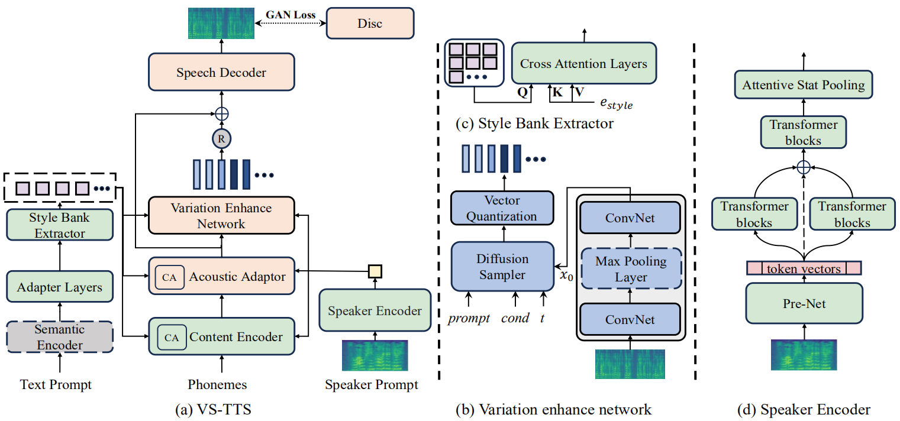

## Overview

Controllable text-to-speech (TTS) aims to achieve flexible and accurate control, 
synthesizing speech across various domains. 
Several recent works adopting natural language descriptions to control speech attributes has gained 
much attention. However, achieving accurate timbre control when utilizing text to manipulate speech 
style poses significant challenges. In light of this, 
we propose VS-TTS, a multi-modal prompt speech synthesis system that allows user-friendly control 
over voice styles while maintain speaker identity. 
Specifically, 1) We present the baseline model for the VS-TTS task, providing detailed descriptions of dataset preprocessing. 
2) We employ a BERT-based text prompt encoder to extract a fixed-length speaking-style-correlated hidden. For speaker prompt, we leverage a multi-stream transformer encoder to learn diverse speaker attributes from multiple views and thus improve speaker similarity. 3) To improve style expressiveness and alleviate one-to-many problem, we introduce a diffusion-based Variation Enhance Network to provide finer grained additional variability information as a supplement for those acoustic features not coverage in natural language prompts. Our extensive evaluations in audiobook dataset (LibriTTS) and multi-corpus emotional datasets demonstrate that VS-TTS outperforms baseline models in terms of style controllability and speaker similarity.

## Model Architecture
<table>
    <tr>
        <td >
 
</td>
    </tr>
</table>

Figure.1 The overall architecture of VS-TTS.

&nbsp;
 
## 1 LibriTTS seen test set

###  Attribute Control

##### 1.1.1 Volume

Volume-1: *A speaker is speaking **softly**: His eyes, which are hazel, are remarkably bright; he has a sight keen as a hawk's.*

Volume-2: *The speaker speaks  with **normal energy**: His eyes, which are hazel, are remarkably bright; he has a sight keen as a hawk's.*

Volume-3: *A speaker with a **vibrant** voice: His eyes, which are hazel, are remarkably bright; he has a sight keen as a hawk's.*

<table>
    <tr>
        <th> Volume</th>
        <th>Audio Prompt</th>
        <th> VS-TTS</th>
        <th> InstructTTS</th>
        <th> PromptStyle</th>
    </tr>
    <tr>
        <th> 1</th>
        <th rowspan='3'> <audio controls id="player" onplay="pauseOthers(this);"><source src="assets/audios/libritts(seen)/volume/audio_prompt.wav" type="audio/mpeg"></audio> </th>
        <th> <audio controls id="player" onplay="pauseOthers(this);"><source src="assets/audios/libritts(seen)/volume/vstts-energy-low.wav" type="audio/mpeg"></audio> </th>
        <th> <audio controls id="player" onplay="pauseOthers(this);"><source src="assets/audios/libritts(seen)/volume/instruct-energy-low.wav" type="audio/mpeg"></audio> </th>
        <th> <audio controls id="player" onplay="pauseOthers(this);"><source src="assets/audios/libritts(seen)/volume/style-energy-low.wav" type="audio/mpeg"></audio> </th>
    </tr>
    <tr>
        <th> 2</th>
        <th> <audio controls id="player" onplay="pauseOthers(this);"><source src="assets/audios/libritts(seen)/volume/vstts-energy-normal.wav" type="audio/mpeg"></audio> </th>
        <th> <audio controls id="player" onplay="pauseOthers(this);"><source src="assets/audios/libritts(seen)/volume/instruct-energy-normal.wav" type="audio/mpeg"></audio> </th>
        <th> <audio controls id="player" onplay="pauseOthers(this);"><source src="assets/audios/libritts(seen)/volume/style-energy-normal.wav" type="audio/mpeg"></audio> </th>
    </tr>	
    <tr>
        <th> 3</th>
        <th> <audio controls id="player" onplay="pauseOthers(this);"><source src="assets/audios/libritts(seen)/volume/vstts-energy-high.wav" type="audio/mpeg"></audio> </th>
        <th> <audio controls id="player" onplay="pauseOthers(this);"><source src="assets/audios/libritts(seen)/volume/instruct-energy-high.wav" type="audio/mpeg"></audio> </th>
        <th> <audio controls id="player" onplay="pauseOthers(this);"><source src="assets/audios/libritts(seen)/volume/style-energy-high.wav" type="audio/mpeg"></audio> </th>
    </tr>	
</table>

##### 1.1.2 Speed

Speed-1: *The person spoke at a **slow pace**: Spargo, much astonished at this reception, passed through an ante room into a handsomely furnished apartment full of books and pictures.*

Speed-2: *The person spoke at a **normal pace**: Spargo, much astonished at this reception, passed through an ante room into a handsomely furnished apartment full of books and pictures.*

Speed-3: *The person spoke at a **fast pace**: Spargo, much astonished at this reception, passed through an ante room into a handsomely furnished apartment full of books and pictures.*

<table>
    <tr>
        <th> Speed</th>
         <th>Audio Prompt</th>
        <th> VS-TTS</th>
        <th> InstructTTS</th>
        <th> PromptStyle</th>
    </tr>
    <tr>
        <th> 1</th>
        <th rowspan='3'> <audio controls id="player" onplay="pauseOthers(this);"><source src="assets/audios/libritts(seen)/speed/audio_prompt.wav" type="audio/mpeg"></audio> </th>
        <th> <audio controls id="player" onplay="pauseOthers(this);"><source src="assets/audios/libritts(seen)/speed/vstts-dur-low.wav" type="audio/mpeg"></audio> </th>
        <th> <audio controls id="player" onplay="pauseOthers(this);"><source src="assets/audios/libritts(seen)/speed/instruct-dur-low.wav" type="audio/mpeg"></audio> </th>
        <th> <audio controls id="player" onplay="pauseOthers(this);"><source src="assets/audios/libritts(seen)/speed/style-dur-low.wav" type="audio/mpeg"></audio> </th>
    </tr>	
    <tr>
        <th> 2</th>
        <th> <audio controls id="player" onplay="pauseOthers(this);"><source src="assets/audios/libritts(seen)/speed/vstts-dur-normal.wav" type="audio/mpeg"></audio> </th>
        <th> <audio controls id="player" onplay="pauseOthers(this);"><source src="assets/audios/libritts(seen)/speed/instruct-dur-normal.wav" type="audio/mpeg"></audio> </th>
        <th> <audio controls id="player" onplay="pauseOthers(this);"><source src="assets/audios/libritts(seen)/speed/style-dur-normal.wav" type="audio/mpeg"></audio> </th>
    </tr>	
    <tr>
        <th> 3</th>
        <th> <audio controls id="player" onplay="pauseOthers(this);"><source src="assets/audios/libritts(seen)/speed/vstts-dur-high.wav" type="audio/mpeg"></audio> </th>
        <th> <audio controls id="player" onplay="pauseOthers(this);"><source src="assets/audios/libritts(seen)/speed/instruct-dur-high.wav" type="audio/mpeg"></audio> </th>
        <th> <audio controls id="player" onplay="pauseOthers(this);"><source 
src="assets/audios/libritts(seen)/speed/style-dur-high.wav" type="audio/mpeg"></audio> </th>
    </tr>	
</table>

##### 1.1.3 Pitch

Pitch-1: *The person says with a **low-key voice**: The King of the Golden River had hardly made the extraordinary exit related in the last chapter, before Hans and Schwartz came roaring into the house very savagely drunk.*

Pitch-2: *The person says with a **normal-key voice**: The King of the Golden River had hardly made the extraordinary exit related in the last chapter, before Hans and Schwartz came roaring into the house very savagely drunk.*

Pitch-3: *The person says with a **high-key voice**: The King of the Golden River had hardly made the extraordinary exit related in the last chapter, before Hans and Schwartz came roaring into the house very savagely drunk.*

<table>
    <tr>
        <th> Pitch</th>
         <th>Audio Prompt</th>
        <th> VS-TTS</th>
        <th> InstructTTS</th>
        <th> PromptStyle</th>
    </tr>
    <tr>
        <th> 1</th>
        <th rowspan='3'> <audio controls id="player" onplay="pauseOthers(this);"><source src="assets/audios/libritts(seen)/pitch/audio_prompt.wav" type="audio/mpeg"></audio> </th>
        <th> <audio controls id="player" onplay="pauseOthers(this);"><source src="assets/audios/libritts(seen)/pitch/vstts-pitch-low.wav" type="audio/mpeg"></audio> </th>
        <th> <audio controls id="player" onplay="pauseOthers(this);"><source src="assets/audios/libritts(seen)/pitch/instruct-pitch-low.wav" type="audio/mpeg"></audio> </th>
        <th> <audio controls id="player" onplay="pauseOthers(this);"><source src="assets/audios/libritts(seen)/pitch/style-pitch-low.wav" type="audio/mpeg"></audio> </th>
    </tr>	
    <tr>
        <th> 2</th>
        <th> <audio controls id="player" onplay="pauseOthers(this);"><source src="assets/audios/libritts(seen)/pitch/vstts-pitch-normal.wav" type="audio/mpeg"></audio> </th>
        <th> <audio controls id="player" onplay="pauseOthers(this);"><source src="assets/audios/libritts(seen)/pitch/instruct-pitch-normal.wav" type="audio/mpeg"></audio> </th>
        <th> <audio controls id="player" onplay="pauseOthers(this);"><source src="assets/audios/libritts(seen)/pitch/style-pitch-normal.wav" type="audio/mpeg"></audio> </th>
    </tr>	
    <tr>
        <th> 3</th>
        <th> <audio controls id="player" onplay="pauseOthers(this);"><source src="assets/audios/libritts(seen)/pitch/vstts-pitch-high.wav" type="audio/mpeg"></audio> </th>
        <th> <audio controls id="player" onplay="pauseOthers(this);"><source src="assets/audios/libritts(seen)/pitch/instruct-pitch-high.wav" type="audio/mpeg"></audio> </th>
        <th> <audio controls id="player" onplay="pauseOthers(this);"><source 
src="assets/audios/libritts(seen)/pitch/style-pitch-high.wav" type="audio/mpeg"></audio> </th>
    </tr>	
</table>

&nbsp;
 

## 2 LibriTTS unseen test set

###  Attribute Control

##### 1.1.1 Volume

Volume-1: *A speaker is speaking **softly**: It was a long ride over the circuitous route by which the steep incline was avoided and it was necessary for the party to make an early start.*

Volume-2: *The speaker speaks  with **normal energy**: It was a long ride over the circuitous route by which the steep incline was avoided and it was necessary for the party to make an early start.*

Volume-3: *A speaker with a **vibrant** voice: It was a long ride over the circuitous route by which the steep incline was avoided and it was necessary for the party to make an early start.*

<table>
    <tr>
        <th> Volume</th>
        <th>Audio Prompt</th>
        <th> VS-TTS</th>
        <th> InstructTTS</th>
        <th> PromptStyle</th>
    </tr>
    <tr>
        <th> 1</th>
        <th rowspan='3'> <audio controls id="player" onplay="pauseOthers(this);"><source src="assets/audios/libritts(unseen)/volume/audio_prompt.wav" type="audio/mpeg"></audio> </th>
        <th> <audio controls id="player" onplay="pauseOthers(this);"><source src="assets/audios/libritts(unseen)/volume/vstts-energy-low.wav" type="audio/mpeg"></audio> </th>
        <th> <audio controls id="player" onplay="pauseOthers(this);"><source src="assets/audios/libritts(unseen)/volume/instruct-energy-low.wav" type="audio/mpeg"></audio> </th>
        <th> <audio controls id="player" onplay="pauseOthers(this);"><source src="assets/audios/libritts(unseen)/volume/style-energy-low.wav" type="audio/mpeg"></audio> </th>
    </tr>
    <tr>
        <th> 2</th>
        <th> <audio controls id="player" onplay="pauseOthers(this);"><source src="assets/audios/libritts(unseen)/volume/vstts-energy-normal.wav" type="audio/mpeg"></audio> </th>
        <th> <audio controls id="player" onplay="pauseOthers(this);"><source src="assets/audios/libritts(unseen)/volume/instruct-energy-normal.wav" type="audio/mpeg"></audio> </th>
        <th> <audio controls id="player" onplay="pauseOthers(this);"><source src="assets/audios/libritts(unseen)/volume/style-energy-normal.wav" type="audio/mpeg"></audio> </th>
    </tr>	
    <tr>
        <th> 3</th>
        <th> <audio controls id="player" onplay="pauseOthers(this);"><source src="assets/audios/libritts(unseen)/volume/vstts-energy-high.wav" type="audio/mpeg"></audio> </th>
        <th> <audio controls id="player" onplay="pauseOthers(this);"><source src="assets/audios/libritts(unseen)/volume/instruct-energy-high.wav" type="audio/mpeg"></audio> </th>
        <th> <audio controls id="player" onplay="pauseOthers(this);"><source src="assets/audios/libritts(unseen)/volume/style-energy-high.wav" type="audio/mpeg"></audio> </th>
    </tr>	
</table>

##### 1.1.2 Speed

Speed-1: *The person spoke at a **slow pace**: The judge refused to admit his evidence, on the ground that the witness had destroyed beforehand all the confidence of the Court in what he was about to say.*

Speed-2: *The person spoke at a **normal pace**: The judge refused to admit his evidence, on the ground that the witness had destroyed beforehand all the confidence of the Court in what he was about to say.*

Speed-3: *The person spoke at a **fast pace**: The judge refused to admit his evidence, on the ground that the witness had destroyed beforehand all the confidence of the Court in what he was about to say.*

<table>
    <tr>
        <th> Speed</th>
         <th>Audio Prompt</th>
        <th> VS-TTS</th>
        <th> InstructTTS</th>
        <th> PromptStyle</th>
    </tr>
    <tr>
        <th> 1</th>
        <th rowspan='3'> <audio controls id="player" onplay="pauseOthers(this);"><source src="assets/audios/libritts(unseen)/speed/audio_prompt.wav" type="audio/mpeg"></audio> </th>
        <th> <audio controls id="player" onplay="pauseOthers(this);"><source src="assets/audios/libritts(unseen)/speed/vstts-dur-low.wav" type="audio/mpeg"></audio> </th>
        <th> <audio controls id="player" onplay="pauseOthers(this);"><source src="assets/audios/libritts(unseen)/speed/instruct-dur-low.wav" type="audio/mpeg"></audio> </th>
        <th> <audio controls id="player" onplay="pauseOthers(this);"><source src="assets/audios/libritts(unseen)/speed/style-dur-low.wav" type="audio/mpeg"></audio> </th>
    </tr>	
    <tr>
        <th> 2</th>
        <th> <audio controls id="player" onplay="pauseOthers(this);"><source src="assets/audios/libritts(unseen)/speed/vstts-dur-normal.wav" type="audio/mpeg"></audio> </th>
        <th> <audio controls id="player" onplay="pauseOthers(this);"><source src="assets/audios/libritts(unseen)/speed/instruct-dur-normal.wav" type="audio/mpeg"></audio> </th>
        <th> <audio controls id="player" onplay="pauseOthers(this);"><source src="assets/audios/libritts(unseen)/speed/style-dur-normal.wav" type="audio/mpeg"></audio> </th>
    </tr>	
    <tr>
        <th> 3</th>
        <th> <audio controls id="player" onplay="pauseOthers(this);"><source src="assets/audios/libritts(unseen)/speed/vstts-dur-high.wav" type="audio/mpeg"></audio> </th>
        <th> <audio controls id="player" onplay="pauseOthers(this);"><source src="assets/audios/libritts(unseen)/speed/instruct-dur-high.wav" type="audio/mpeg"></audio> </th>
        <th> <audio controls id="player" onplay="pauseOthers(this);"><source 
src="assets/audios/libritts(unseen)/speed/style-dur-high.wav" type="audio/mpeg"></audio> </th>
    </tr>	
</table>

##### 1.1.3 Pitch

Pitch-1: *The person says with a **low-key voice**: But upon the question of labour mr Grammont was fierce, even for an American business man, and one night at a dinner party he discovered his daughter displaying what he considered an improper familiarity with socialist ideas.*

Pitch-2: *The person says with a **normal-key voice**: But upon the question of labour mr Grammont was fierce, even for an American business man, and one night at a dinner party he discovered his daughter displaying what he considered an improper familiarity with socialist ideas.*

Pitch-3: *The person says with a **high-key voice**: But upon the question of labour mr Grammont was fierce, even for an American business man, and one night at a dinner party he discovered his daughter displaying what he considered an improper familiarity with socialist ideas.*

<table>
    <tr>
        <th> Pitch</th>
         <th>Audio Prompt</th>
        <th> VS-TTS</th>
        <th> InstructTTS</th>
        <th> PromptStyle</th>
    </tr>
    <tr>
        <th> 1</th>
        <th rowspan='3'> <audio controls id="player" onplay="pauseOthers(this);"><source src="assets/audios/libritts(unseen)/pitch/audio_prompt.wav" type="audio/mpeg"></audio> </th>
        <th> <audio controls id="player" onplay="pauseOthers(this);"><source src="assets/audios/libritts(unseen)/pitch/vstts-pitch-low.wav" type="audio/mpeg"></audio> </th>
        <th> <audio controls id="player" onplay="pauseOthers(this);"><source src="assets/audios/libritts(unseen)/pitch/instruct-pitch-low.wav" type="audio/mpeg"></audio> </th>
        <th> <audio controls id="player" onplay="pauseOthers(this);"><source src="assets/audios/libritts(unseen)/pitch/style-pitch-low.wav" type="audio/mpeg"></audio> </th>
    </tr>	
    <tr>
        <th> 2</th>
        <th> <audio controls id="player" onplay="pauseOthers(this);"><source src="assets/audios/libritts(unseen)/pitch/vstts-pitch-normal.wav" type="audio/mpeg"></audio> </th>
        <th> <audio controls id="player" onplay="pauseOthers(this);"><source src="assets/audios/libritts(unseen)/pitch/instruct-pitch-normal.wav" type="audio/mpeg"></audio> </th>
        <th> <audio controls id="player" onplay="pauseOthers(this);"><source src="assets/audios/libritts(unseen)/pitch/style-pitch-normal.wav" type="audio/mpeg"></audio> </th>
    </tr>	
    <tr>
        <th> 3</th>
        <th> <audio controls id="player" onplay="pauseOthers(this);"><source src="assets/audios/libritts(unseen)/pitch/vstts-pitch-high.wav" type="audio/mpeg"></audio> </th>
        <th> <audio controls id="player" onplay="pauseOthers(this);"><source src="assets/audios/libritts(unseen)/pitch/instruct-pitch-high.wav" type="audio/mpeg"></audio> </th>
        <th> <audio controls id="player" onplay="pauseOthers(this);"><source 
src="assets/audios/libritts(unseen)/pitch/style-pitch-high.wav" type="audio/mpeg"></audio> </th>
    </tr>	
</table>

&nbsp;
 
